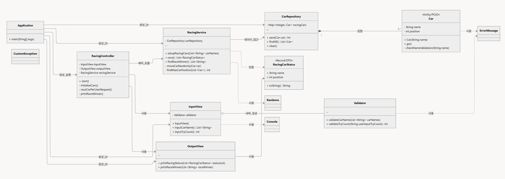

# java-racingcar-precourse

* `Java` 로 프로그래밍된 초간단 자동차 경주 게임입니다.
* `우아한 테크코스 8기` 의 `2주차` 과제입니다.

---

## 1. 아키텍처 및 시스템 설계

#### A. 핵심 설계 패턴

해당 프로그램은 **MVC Pattern** 을 바탕으로 구성되었습니다.

**이유**

- 해당 프로그램의 사이즈는 충분히 작다고 생각합니다.
- 해당 프로그램 요구사항에는 과제 제출이 끝난 이후에도 지속적인 확장 및 유지 보수를 하라는 요구사항이 현재 상황에서는 없습니다.
- `MVC` 패턴만 잘 준수하여도 테스트 용이성이 높아질 것으로 판단했습니다.
- 따라서 `MVC` 보다 더욱 복잡한 패턴을 사용하는 것은 `오버 엔지니어링` 이라고 생각하였습니다.

#### B. 클래스 다이어그램

**Model**

- `Car`: 자동차의 이름과 위치를 관리하고 이동 기능 제공
- `CarRepository`: 자동차 객체들을 메모리에 저장/조회
- `RacingService`: 경주 진행, 자동차 이동, 우승자 선정 등 핵심 로직 처리
- `Validator`: 사용자 입력의 유효성 검사

**View**

- `InputView`: 사용자로부터 자동차 이름과 시도 횟수 입력받기
- `OutputView`: 경주 상태와 우승자 결과 출력
- `RacingCarStatus`: 경주 상태 데이터를 전달하는 DTO

**Controller**

- `RacingController`: View로부터 입력을 받아 Service에 처리를 위임하고 결과를 출력하는 전체 흐름 관리

**Application**

- 모든 객체를 초기화하고 의존성을 주입하여 Controller 실행

---

## 2. 주요 기능

#### **A. 사용자 입력 처리**

* **A-1. 자동차 이름 입력 및 유효성 검사**
    * 사용자로부터 경주할 자동차 이름 입력받기 (쉼표로 구분)
    * **A-1.1. 이름 길이 유효성 검사**: 자동차 이름은 5자 이하만 가능 (초과 시 `IllegalArgumentException` 발생)
    * **A-1.2. 이름 공백/빈 문자열 유효성 검사**: 이름이 공백이거나 빈 문자열인지 확인
* **A-2. 시도할 횟수 입력 및 유효성 검사**
    * 사용자로부터 시도할 횟수 입력받기
    * **A-2.1. 숫자 형식 유효성 검사**: 입력 값이 숫자인지 확인 (아닐 경우 `IllegalArgumentException` 발생)
    * **A-2.2. 양수 유효성 검사**: 시도할 횟수는 1 이상의 양수여야 함 (0 또는 음수일 경우 `IllegalArgumentException` 발생)

#### **B. 게임 로직**

* **B-1. 자동차 생성 및 초기화**
    * 입력받은 이름으로 자동차 객체들을 생성하고 초기 위치(0) 설정
* **B-2. 자동차 전진/정지 기능** (각 시도 횟수마다 반복)
    * **B-2.1. 무작위 값 생성**: 0-9 사이의 무작위 값 구하기 ( `Randoms.pickNumberInRange(0, 9)` 사용)
    * **B-2.2. 전진 조건 확인**: 무작위 값이 4 이상일 경우
    * **B-2.3. 자동차 위치 업데이트**: 전진 조건 충족 시 자동차의 현재 위치(position) 1 증가
* **B-3. 게임 진행 관리**
    * 전체 시도 횟수만큼 B-2 기능 반복 수행

#### **C. 결과 출력**

* **C-1. 각 차수별 실행 결과 출력** (매 시도 후)
    * 각 자동차의 이름과 현재 전진 상태(`-` 문자로 표현된 위치) 출력
* **C-2. 최종 우승자 선정**
    * 모든 자동차 중 가장 멀리 전진한 자동차의 최대 위치(maxPosition) 찾기
    * 최대 위치와 동일한 위치를 가진 자동차들을 우승자로 선정
* **C-3. 최종 우승자 출력**
    * 선정된 우승자가 한 명 이상일 경우 쉼표(`,`)로 구분하여 출력 (예: "최종 우승자 : pobi, jun")